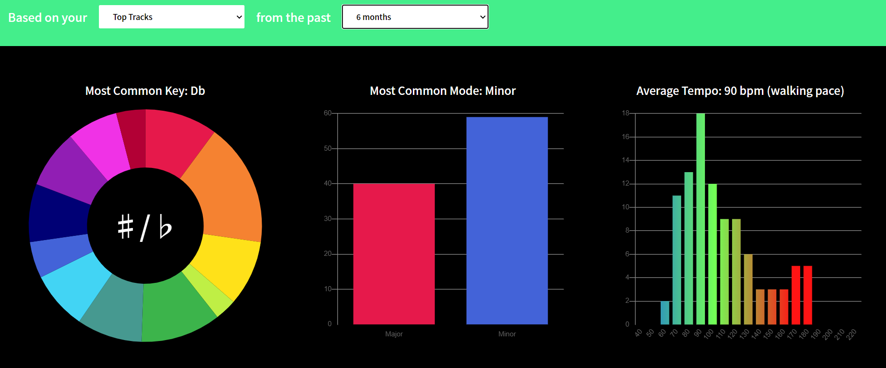

# Statify

[Click here for live site](https://statify-app.herokuapp.com/#/)

## Overview

Statify displays information about a user's music taste using their Spotify listening history and playlists. After selecting a dataset (ie: most recent songs, most frequent songs, playlist XYZ, etc.), users can view trends about their music, including favorite key, mode, tempo, popularity, and other qualities on Statify's dynamic rerendering graph components.

## Technologies, Libraries, APIs

- JavaScript
- React
- Redux
- Express
- Node
- Spotify API

## Contributors 

- [Chris Bram](https://github.com/cpbram2011)
- [Michael Wideburg](https://github.com/mwideburg)

